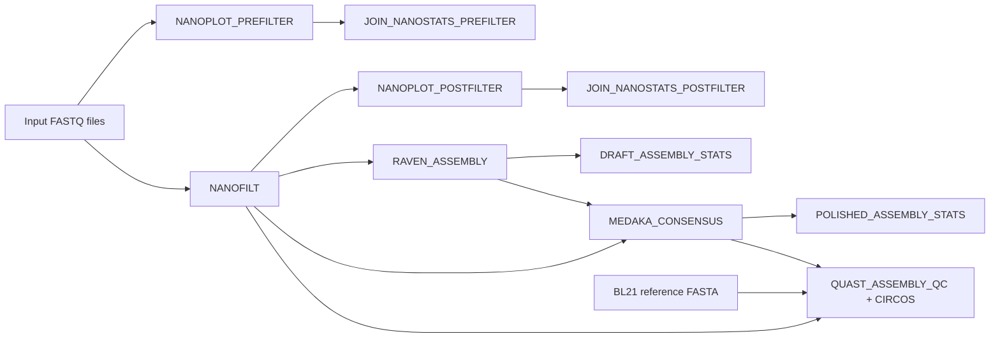

# MinION isolate assembly + QC + BL21 reference comparison (Nextflow DSL2)

This repository contains a **Nextflow DSL2** workflow adapted from a Galaxy workflow for:

- raw-read QC with **NanoPlot**
- read filtering with **NanoFilt**
- post-filter QC with **NanoPlot**
- joined NanoStats summary tables across all samples before and after filtering
- draft assembly with **Raven**
- draft assembly summary statistics with **assembly-stats**
- polishing with **Medaka**
- polished assembly summary statistics with **assembly-stats**
- assembly evaluation against an *E. coli* BL21 reference with **QUAST**, including **Circos** plots

The workflow was built for **demultiplexed MinION isolate FASTQ files** plus a **BL21 reference FASTA** used as an internal control reference.

---

## Important status note

The workflow is packaged here in a reproducible GitHub-ready structure so it can be versioned, reused, and compared against Galaxy results.

Benchmarking against the original Galaxy workflow has confirmed that the Nextflow workflow produces the same results for the validated inputs, including the Raven draft assemblies. The earlier Raven parity concern for the BL21 control has been resolved.

In other words:

- the repository is suitable for development, comparison, reruns, and reporting
- the workflow logic is preserved in a reproducible Nextflow structure
- Galaxy and Nextflow outputs matched exactly for the benchmarked validation run

---

## Using This Repo With AI Coding Apps

Open the repository from the project root in the OpenAI Codex app or Claude Code. Use the app to inspect commands, run checks, and troubleshoot failures, while keeping large sequencing data out of Git history.

Recommended folder layout for AI-assisted runs:

```text
~/Nextflow_workflow_v2/
├── data/      # FASTQ/FASTQ.GZ files copied from Google Drive or other storage
├── refs/      # spike-in control reference genome FASTA, e.g. BL21_reference.fasta
├── results/   # published workflow outputs
└── work/      # Nextflow intermediate work directory
```

Keep active runs on the Linux/WSL filesystem. Copy FASTQ files into `data/` and the spike-in control reference genome into `refs/`; after the run, archive `results/` back to Google Drive or another shared location. Avoid running directly from `C:\...`, Google Drive, or other Windows-mounted folders when possible.

Useful prompts for the OpenAI Codex app or Claude Code:

```text
Inspect this repository and tell me the exact Nextflow command to run. My reads are in data/*.fastq.gz, the spike-in control reference genome is refs/BL21_reference.fasta, and outputs should go to results/.
```

```text
Run the workflow from this repository, explain any failure in plain language, and use -resume after fixing the issue.
```

```text
After the workflow finishes, summarize the main output folders, confirm that QUAST report.tsv files exist, and confirm that QUAST Circos plots were created under results/quast/.
```

Tips:

- Ask the AI app to inspect the repository before editing `main.nf`.
- Paste absolute paths when your data are outside the repository.
- Keep raw FASTQ files, reference FASTA files, `work/`, and `results/` out of Git unless you intentionally want to publish them.
- When comparing against Galaxy, ask the AI app to compare Raven FASTA/GFA, Medaka consensus FASTA, QUAST reports, and Circos plots sample by sample.

---

## Workflow diagram



## GitHub repository extras in this version

This repository version also includes:

- `LICENSE` — MIT license
- `CHANGELOG.md` — release history
- `CONTRIBUTING.md` — editing and contribution guidance
- `.github/workflows/repo-checks.yml` — lightweight GitHub Actions checks
- `docs/publish_to_github.md` — step-by-step publishing guide

These extras make it easier to track changes, publish the project cleanly, and catch simple repository issues after pushes and pull requests.

---

## Repository structure

```text
minion_nextflow_repo/
├── .gitignore
├── README.md
├── main.nf
├── nextflow.config
├── bin/
│   └── join_nanostats_summary.py
├── conf/
│   └── user_paths.template.config
├── docs/
│   └── repo_structure.md
└── envs/
    └── environment.yml
```

---

## Recommended way to use working folders

### Short version

The easiest and safest workflow is:

1. **keep the GitHub repository and active run directory in Linux/WSL**, not inside Google Drive
2. **copy input FASTQ files and the BL21 reference into that Linux project directory**
3. run Nextflow there
4. **copy the published `results/` folder back to Google Drive** after the run completes

### Why this is recommended

For WSL users, paths under Windows mounted drives such as `/mnt/c/...`, especially long paths containing spaces like `Google Drive` or `My Drive`, are more fragile for some bioinformatics tools and often slower than working in the Linux filesystem. During development of this workflow, Medaka in particular was much happier once the project was run from a Linux-side directory such as:

```text
/home/<your_linux_username>/Nextflow_workflow_v2
```

### Practical rule

- **Working directory for active runs:** Linux filesystem
- **Archival/storage/comparison directory:** Google Drive / Windows filesystem

That split gives you the best combination of stability and convenience.

---

## Prerequisites

This repository assumes you already have:

- WSL/Ubuntu on Windows, or Linux/macOS
- Java installed
- Nextflow installed
- Mamba or Conda available

The required tools are listed in `envs/environment.yml`.

### Create the environment

```bash
mamba env create -f envs/environment.yml
mamba activate minion-nf
```

If the environment already exists and you just want to update it:

```bash
mamba env update -f envs/environment.yml --prune
mamba activate minion-nf
```

---

## Two ways to provide folder paths

There are two good ways to tell the workflow where your data and results live.

### Option A: pass paths on the command line

This is the simplest and the method I recommend for most users.

Example:

```bash
nextflow run main.nf   --input "data/*.fastq"   --ref "refs/BL21_reference.fasta"   --outdir results
```

### Option B: use a user-specific config file with placeholders

This repository includes:

```text
conf/user_paths.template.config
```

Copy it and edit the placeholders:

```bash
cp conf/user_paths.template.config conf/user_paths.config
```

Then replace:

- `<PATH_TO_PROJECT_WORKDIR>`
- the input glob
- the reference FASTA path
- the output directory

Example edited file:

```groovy
params {
  input  = '/home/yourname/Nextflow_workflow_v2/data/*.fastq'
  ref    = '/home/yourname/Nextflow_workflow_v2/refs/BL21_reference.fasta'
  outdir = '/home/yourname/Nextflow_workflow_v2/results'
}
```

Run with:

```bash
nextflow run main.nf -c conf/user_paths.config
```

### Which approach is better?

For this workflow, **keeping the code path-agnostic and supplying paths at runtime is better than hard-coding folder paths inside `main.nf`**.

That is why the repository uses:

- sensible defaults in `main.nf`
- placeholders in a template config file
- explicit CLI parameters when you want full control

---

## Step-by-step: Windows + WSL + Google Drive workflow

This section is deliberately detailed.

### 1. Choose your Linux-side project directory

Example:

```bash
mkdir -p ~/Nextflow_workflow_v2
cd ~/Nextflow_workflow_v2
```

### 2. Put the repository there

If you cloned from GitHub:

```bash
git clone <YOUR_GITHUB_REPO_URL> ~/Nextflow_workflow_v2
cd ~/Nextflow_workflow_v2
```

If you downloaded the repository as a ZIP, extract it and move the files into:

```text
/home/<your_linux_username>/Nextflow_workflow_v2
```

### 3. Create data and refs directories

```bash
mkdir -p data refs results
```

### 4. Copy FASTQ files from Google Drive / Windows into the Linux project folder

Suppose your FASTQs live in this Windows folder:

```text
C:\Users\<WINDOWS_USERNAME>\Google Drive\<PROJECT_ROOT>\input_fastq
```

In WSL, that is:

```text
/mnt/c/Users/<WINDOWS_USERNAME>/Google Drive/<PROJECT_ROOT>/input_fastq
```

Copy uncompressed FASTQ files with:

```bash
cp "/mnt/c/Users/<WINDOWS_USERNAME>/Google Drive/<PROJECT_ROOT>/input_fastq"/*.fastq data/
```

Or gzipped FASTQ files with:

```bash
cp "/mnt/c/Users/<WINDOWS_USERNAME>/Google Drive/<PROJECT_ROOT>/input_fastq"/*.fastq.gz data/
```

### 5. Copy the BL21 reference FASTA into `refs/`

Example:

```bash
cp "/mnt/c/Users/<WINDOWS_USERNAME>/Google Drive/<PROJECT_ROOT>/refs/BL21_reference.fasta" refs/
```

### 6. Verify the inputs

```bash
ls -lh data
ls -lh refs
```

### 7. Activate the environment

```bash
source ~/.bashrc
mamba activate minion-nf
```

### 8. Run the workflow

If your reads are uncompressed:

```bash
nextflow run main.nf   --input "data/*.fastq"   --ref "refs/BL21_reference.fasta"   --outdir results
```

If your reads are gzipped:

```bash
nextflow run main.nf   --input "data/*.fastq.gz"   --ref "refs/BL21_reference.fasta"   --outdir results
```

### 9. Resume a failed run

```bash
nextflow run main.nf   --input "data/*.fastq"   --ref "refs/BL21_reference.fasta"   --outdir results   -resume
```

Adjust the input glob if using gzipped reads.

---

## Where files are created during a run

There are **three categories of locations** to understand.

### 1. The project folder

Example:

```text
/home/yourname/Nextflow_workflow_v2
```

This contains:

- repository files
- `data/`
- `refs/`
- `results/`
- `.nextflow.log`
- `work/`

### 2. The `work/` directory

This is where Nextflow stages and executes process-specific jobs.

Example:

```text
/home/yourname/Nextflow_workflow_v2/work
```

This directory is useful for:

- debugging failed jobs
- inspecting the exact command run by a process
- retrieving intermediate files not published to `results/`

Common debug files inside a process work directory include:

- `.command.sh`
- `.command.run`
- `.command.out`
- `.command.err`

### 3. The `results/` directory

This is the main published output directory you usually care about.

Example:

```text
/home/yourname/Nextflow_workflow_v2/results
```

This contains the final outputs copied from each process.

---

## What results to expect when the run finishes

### `results/prefilter_qc/`
Contains per-sample raw-read NanoPlot outputs:

- `*.prefilter.html`
- `*.prefilter_nanostats.txt`

### `results/prefilter_qc_summary/`
Contains the combined summary table across all samples before filtering:

- `prefilter_nanostats_summary.tsv`

### `results/filtered_reads/`
Contains filtered reads and NanoFilt logs:

- `*.filtered.fastq.gz`
- `*.nanofilt.log`

### `results/postfilter_qc/`
Contains per-sample filtered-read NanoPlot outputs:

- `*.postfilter.html`
- `*.postfilter_nanostats.txt`

### `results/postfilter_qc_summary/`
Contains the combined summary table across all samples after filtering:

- `postfilter_nanostats_summary.tsv`

### `results/raven/`
Contains draft assemblies:

- `*.raven.fasta`
- `*.raven.gfa`

### `results/assembly_stats/`
Contains draft and polished assembly statistics:

- `*.draft.assembly_stats.tsv`
- `*.polished.assembly_stats.tsv`

### `results/medaka/`
Contains the Medaka output directories. The most important file is:

- `consensus.fasta`

inside each sample directory.

### `results/quast/`
Contains QUAST outputs per sample, including Circos plots. Most important files:

- `report.tsv`
- `report.html`
- `circos/circos.png`
- `circos/legend.txt`

---

## How to inspect results quickly

List everything:

```bash
find results -type f
```

Or browse by folder:

```bash
ls -R results
```

---

## How to open the Linux project folder or results folder from Windows Explorer

From WSL:

```bash
explorer.exe .
```

Or just the results folder:

```bash
explorer.exe results
```

If you want the direct Windows-style WSL path, it looks like:

```text
\\wsl$\Ubuntu\home\yourname\Nextflow_workflow_v2\results
```

---

## How to export final results back to Google Drive

This is the recommended pattern once the workflow completes successfully.

Suppose you want to export to this Windows folder:

```text
C:\Users\<WINDOWS_USERNAME>\Google Drive\<PROJECT_ROOT>\Nextflow_results
```

In WSL:

```bash
mkdir -p "/mnt/c/Users/<WINDOWS_USERNAME>/Google Drive/<PROJECT_ROOT>/Nextflow_results"
cp -r results/* "/mnt/c/Users/<WINDOWS_USERNAME>/Google Drive/<PROJECT_ROOT>/Nextflow_results/"
cp -v .nextflow.log "/mnt/c/Users/<WINDOWS_USERNAME>/Google Drive/<PROJECT_ROOT>/Nextflow_results/" 2>/dev/null || true
cp -v main.nf nextflow.config "/mnt/c/Users/<WINDOWS_USERNAME>/Google Drive/<PROJECT_ROOT>/Nextflow_results/" 2>/dev/null || true
```

This will export:

- final results
- the run log
- the workflow code used
- the config used

That makes comparison with Galaxy results much easier.

---

## Suggested comparison strategy versus Galaxy

For sample-by-sample comparison, inspect:

1. joined NanoStats summaries before and after filtering
2. filtered FASTQ files
3. Raven FASTA and GFA
4. Medaka consensus FASTA
5. QUAST `report.tsv` and `circos/circos.png`
6. assembly-stats TSV files

If the goal is workflow validation rather than just routine execution, compare outputs in that order.

---

## Validation status: Galaxy parity confirmed

Benchmarking against the Galaxy workflow confirmed that both workflows produce the exact same results for the validated run. The earlier Raven parity investigation is resolved.

For future regression checks, the most useful files to compare are:

- `results/raven/*.raven.fasta`
- `results/raven/*.raven.gfa`
- `results/quast/*/report.tsv`
- `results/quast/*/circos/circos.png`
- the corresponding Galaxy outputs for the same sample

---

## Troubleshooting

### The workflow stops and says a process failed

Check:

```bash
tail -n 100 .nextflow.log
```

Then inspect the process work directory mentioned in the error.

### I want to see the exact command Nextflow ran

In the relevant `work/<hash>/` directory:

```bash
cat .command.sh
cat .command.out
cat .command.err
```

### I want to start again from scratch

Be careful with this. It removes local work products.

```bash
rm -rf work results .nextflow*
```

Then rerun.

### I want to continue without recomputing successful steps

Use:

```bash
nextflow run main.nf ... -resume
```

---

## Example minimal run

```bash
mamba activate minion-nf
cd ~/Nextflow_workflow_v2
nextflow run main.nf   --input "data/*.fastq"   --ref "refs/BL21_reference.fasta"   --outdir results
```

---

## Final recommendation

Use this repository as follows:

- keep the repository itself under version control
- keep active runs in Linux/WSL
- keep Google Drive as the destination for exported final outputs and comparison snapshots
- avoid hard-coding personal folder paths in `main.nf`
- use CLI parameters or `conf/user_paths.config` for user-specific path choices

That gives you a workflow that is easier to rerun, share, inspect, compare to Galaxy, and eventually publish.

---

## Building this repository in your GitHub account

A detailed guide is included in:

```text
docs/publish_to_github.md
```

### Short version

#### Create a new empty repository on GitHub

Do not add a README, license, or `.gitignore` during creation if you are going to push this prepared repository as-is.

#### Then from WSL/Linux

```bash
cd /path/to/minion_nextflow_repo_v2
git init
git branch -M main
git add .
git commit -m "Initial commit: Nextflow workflow repository"
git remote add origin https://github.com/YOUR-USERNAME/YOUR-REPOSITORY.git
git push -u origin main
```

#### After the first push

Open the repository on GitHub and confirm:

- the files and folders are present
- `README.md` renders properly
- the `Actions` tab shows the repository checks workflow if enabled
